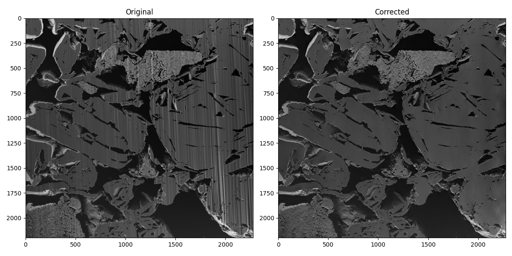
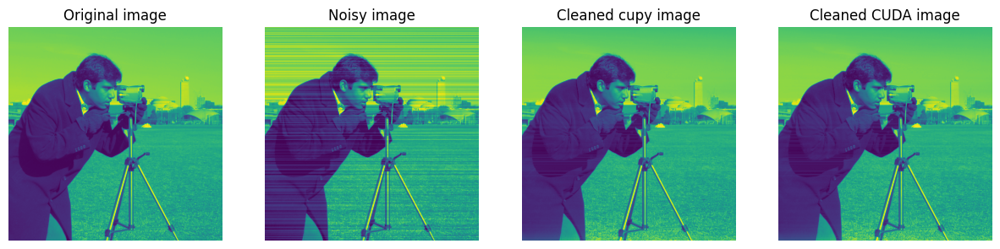
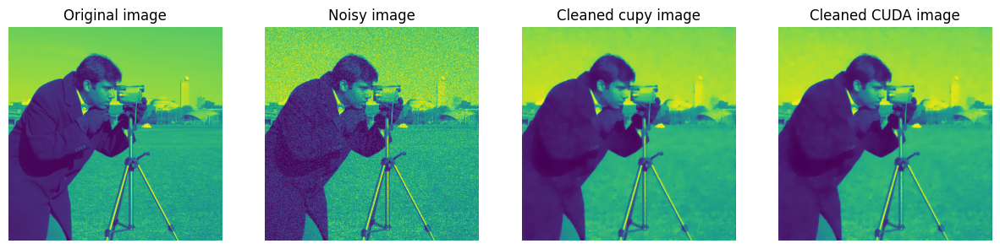
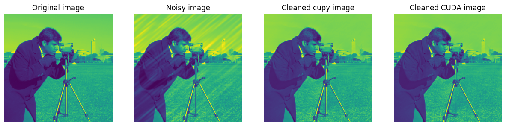

# pyvsnr



## Description

<!-- This repository contains the python sources of the 2D-CPU/GPU based denoising
 code of the VSNR algorithm (originaly coded in MATLAB - see the Pierre Weiss 
 [website](https://www.math.univ-toulouse.fr/~weiss/PageCodes.html)).
 
 A python GPU-**CUDA** implementation (more performant on big images) is also
  available at [https://github.com/CEA-MetroCarac/pyVSNR](https://github.com/CEA-MetroCarac/pyVSNR) -->

`pyvsnr` is a Python library for computing the Variational Signal-to-Noise Ratio (VSNR) in 2D images. It provides both CPU (NumPy) and GPU (CuPy or CUDA) implementations for efficient computation.

## Installation

```bash
pip install pyvsnr
```

In case of problem during CUDA execution (typically OSError or 'access memory error'),
it may be necessary to **recompile** the shared library from source (see below).

## Requirements

For **CPU** execution, the vsnr algorithm requires only the
[NumPy](https://numpy.org/) package, with **matplotlib** and **scikit-image**
packages for examples and tests running.

For **GPU** execution, a working CUDA installation is necessary wether you want to use the CUDA version directly or the cupy one. We recommend using the [CuPy](https://cupy.dev) library, which was 10x faster in the tests. Please ensure that you install the correct version of CuPy that corresponds to your CUDA version (for example, if you're using CUDA 12.x, you should install `cupy-cuda12x`). See the [installation instructions](https://docs.cupy.dev/en/stable/install.html) for more details.

- numpy
- cupy (**optional** but strongly recommended, allows for GPU computation)
- matplotlib, scikit-image (**optional**, for examples and tests execution only)

<!-- The Jupyter notebook requires all the above packages, plus jupyter. It is only used for examples and tests. -->

## Usage
<!-- To use `pyvsnr`, you can import the `vsnr2d` function from `vsnr2d.py` or the `vsnr2d_cuda` function from `vsnr2d_cuda.py`. -->

Here is a basic example using numpy:

```python
import numpy as np
from pyvsnr import vsnr2d

img = np.random.random((100, 100))  # Input image
filters = [{'name':'Dirac', 'noise_level':0.35}]  # List of filters
nite = 20   # Number of iterations
beta = 10.  
xp = np     # numpy or cupy

# Compute VSNR using numpy or cupy
img_corr_py = vsnr2d(img, filters, nite, beta, xp)
```

And for CUDA:

```python
from pyvsnr import vsnr2d_cuda

# Compute VSNR using CUDA
img_corr_cuda = vsnr2d_cuda(img, filters, nite, beta, nblocks='auto')
```

## Examples

The `tests` directory contains a Jupyter notebook with examples and performance tests. You can run it using:

```bash
jupyter notebook tests/notebook.ipynb
```

**Stripes removal example :**

**Gaussian noise removal example :**

**Curtains removal example :**


<!-- PUT EXAMPLES IMAGES -->

## Shared library re-compilation

If you encounter shared library load errors then you may need
to recompile from source. This requires a working CUDA installation
with `nvcc` compiler. The source code is distributed with this package
and is found in the install directory, find this using:

```bash
python -c 'import pyvsnr; print(pyvsnr.PRECOMPILED_PATH)'
```

Navigate to this directory and re-compile for your system using the following, on linux:

```bash
cd ...
nvcc -lcufft -lcublas --compiler-options '-fPIC' -o libvsnr2d.so --shared vsnr2d.cu
```

and on Windows:

```powershell
cd ...
nvcc -lcufft -lcublas -o libvsnr2d.dll --shared vsnr2d.cu
```

## Authors informations

This Python port of the original code was developed by Killian PAVY, with guidance and direction from Patrick QUEMERE.

All credit for the original code goes to Jean EYMERIE and Pierre WEISS.

In case you use the results of this code in your article, please don't forget to cite:

- Fehrenbach, Jérôme, Pierre Weiss, and Corinne Lorenzo. "*Variational algorithms to remove stationary noise: applications to microscopy imaging.*" IEEE Transactions on Image Processing 21.10 (2012): 4420-4430.
- Fehrenbach, Jérôme, and Pierre Weiss. "*Processing stationary noise: model and parameter selection in variational methods.*" SIAM Journal on Imaging Sciences 7.2 (2014): 613-640.
- Escande, Paul, Pierre Weiss, and Wenxing Zhang. "*A variational model for multiplicative structured noise removal.*" Journal of Mathematical Imaging and Vision 57.1 (2017): 43-55.

<!-- The main source code is located in the `src` directory:

- `vsnr2d.py`: Contains the main `vsnr2d` function for computing VSNR using numpy or cupy.
- `vsnr2d_cuda.py`: Contains the CUDA implementation of VSNR, including the `vsnr2d_cuda` function.
<br>
The `tests` directory contains unit tests and performance tests:

- `test_cuda_equals_py.py`: Tests to ensure the CUDA and Python implementations produce the same results.
- `notebok.ipynb`: Jupyter notebook for examples & performance testing. -->