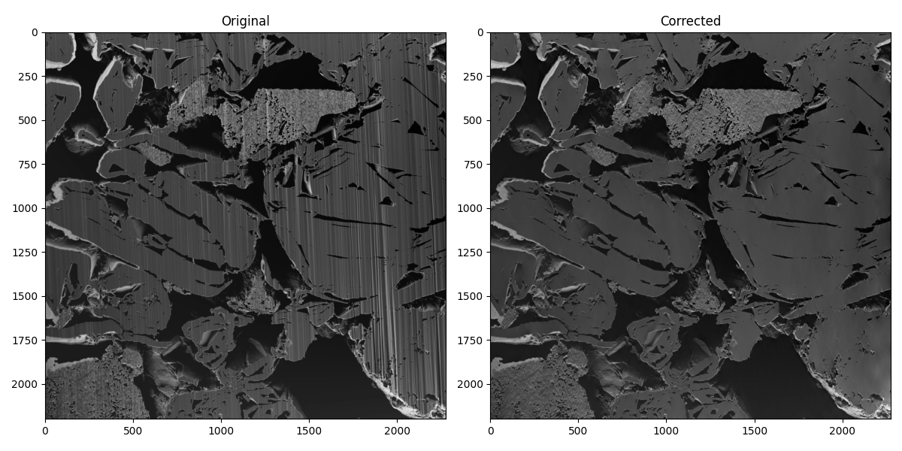
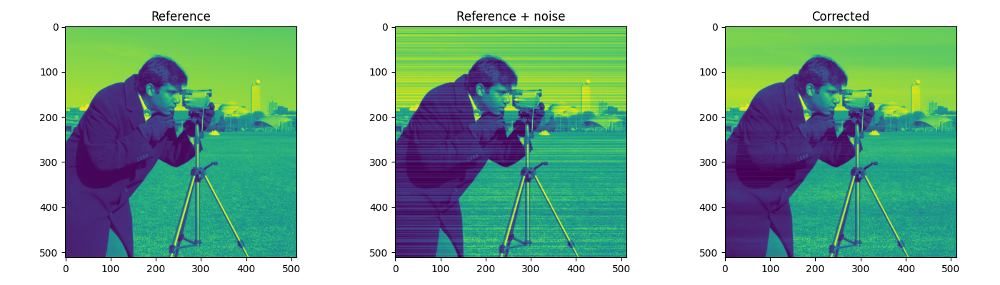
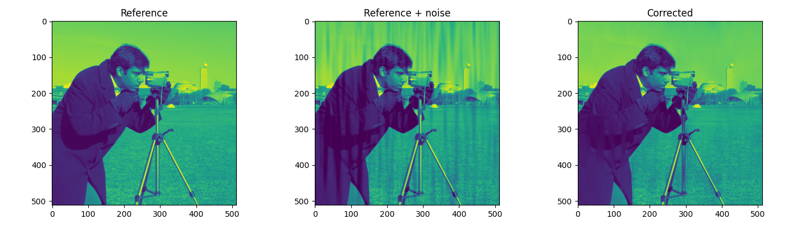
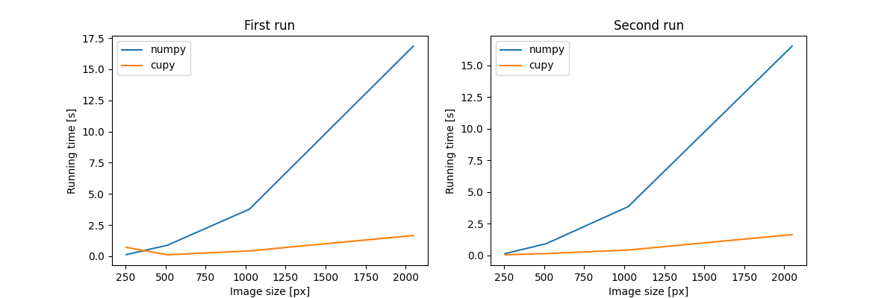

# pyvsnr



## Description

This repository contains the sources of the 2D-CPU/GPU based denoising codes of
 the VSNR algorithm.
 
## Installation

    $ pip install pyvsnr

## Requirements

For CPU execution, the vsnr algorithm requires only the
[numpy](https://numpy.org/) package, with **matplotlib** and **tifffile**
packages for examples/tests running.

For GPU execution, the [cupy](https://cupy.dev) library is required.
Follow the [installaton instructions](https://docs.cupy.dev/en/stable/install.html)
for more details.

- numpy
- cupy (for GPU execution, optional)
- matplotlib
- tifffile

## Usage

For a single image processing :

```python
from pyvsnr import VSNR
from skimage import io

# read the image to correct
img = io.imread('my_image.tif')

# vsnr object creation
vsnr = VSNR(img.shape)

# add filter (at least one !)
vsnr.add_filter(alpha=1e-2, name='gabor', sigma=(1, 30), theta=20)
vsnr.add_filter(alpha=5e-2, name='gabor', sigma=(3, 40), theta=20)

# vsnr initialization
vsnr.initialize()

# image processing
img_corr = vsnr.eval(img, maxit=100, cvg_threshold=1e-4)

...
```
Some applicative examples are given in 
[examples.py](https://github.com/patquem/pyvsnr/tree/main/src/pyvsnr/examples.py). 
 
**stripes removal example** :

    $ python
    >>> from pyvsnr.examples import ex_camera 
    >>> ex_camera('stripes') 



**curtains removal example** :

    $ python
    >>> from pyvsnr.examples import ex_camera 
    >>> ex_camera('curtains') 



**curtains removal example on real image (FIB-SEM)** :

    $ python
    >>> from pyvsnr.examples import ex_fib_sem 
    >>> ex_fib_sem() 


**Note 1 :** in case of images batchs, in particularly in the case of
stacks where successive images are quite similar (FIB-SEM slices for instance),
computation time can be significantly decreased by this way :

```python
import glob
from pyvsnr import VSNR
from skimage import io

fnames = sorted(glob.glob('my_directory/*.tif'))
img0 = io.imread(fnames[0])
vsnr = VSNR(img0.shape) # assuming all the images have the same size !!!
vsnr.add_filter(alpha=1e-2, name='gabor', sigma=(1, 30), theta=20)
vsnr.add_filter(alpha=5e-2, name='gabor', sigma=(3, 40), theta=20)
vsnr.initialize()

# images processing
for fname in fnames:
    img = io.imread(fname)
    img_corr = vsnr.eval(img, maxit=100, cvg_threshold=1e-4)
    ...
```
**Note 2 :** in case of GPU executions, the first run is always more longer
 than the other ones. Keep it in mind when evaluating your processing time.
 
 **Running times evolution :** 
 
     $ python
    >>> from pyvsnr.examples import ex_perf_evaluation 
    >>> ex_perf_evaluation() 
    


## Developers information

Before pushing your developments, be sure the unitests run correctly.

    $ python pyvsnr.tests.py
    
## Authors information

This is a port of the original Matlab code by Jerome FEHRENBACH, Pierre
WEISS to python.

All credit goes to the original author.

In case you use the results of this code with your article, please don't forget
to cite:

- Fehrenbach, Jérôme, Pierre Weiss, and Corinne Lorenzo. "*Variational algorithms to remove stationary noise: applications to microscopy imaging.*" IEEE Transactions on Image Processing 21.10 (2012): 4420-4430.
- Fehrenbach, Jérôme, and Pierre Weiss. "*Processing stationary noise: model and parameter selection in variational methods.*" SIAM Journal on Imaging Sciences 7.2 (2014): 613-640.
- *Escande, Paul, Pierre Weiss, and Wenxing Zhang. "*A variational model for multiplicative structured noise removal.*" Journal of Mathematical Imaging and Vision 57.1 (2017): 43-55.

